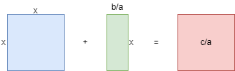

# Quadratic equation
*Quadratic equation* are equation $\ ax^2 + bx = c\$ or $\ ax^2 + bx + c = 0\$ where *a*, *b*, *c* are constants.
 
# Solving
+ Divide everything with constant *a*
$\ x^2 + {b \over a}x = {c \over a}\$
+ Imagine the current equation is like this 
 
